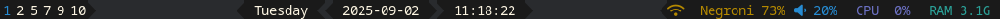

# My Dotfiles

These are my dotfiles for Fedora Linux with Sway window manager. They work for me and my workflow. They may not work for you and your workflow. Dotfiles are very personal. I recommend against copying anyone's dotfiles directly and in favour of looking at the screenshots, reading the files, and deciding what would work for you. I also recommend looking at other people's dotfiles and see how they solve the same problems.

## Details

* **OS**: Fedora
* Window manager: Sway
* Status bar: Waybar
* Notifications: Dunst
* Terminal: Foot
* Editor: Neovim
* IDE: None
* File manager: Yazi
* Spotify client: spotify_player
* Browser: Firefox

## Screenshots

Basic state:


Status bar:


The date is centred on screen but appears off-centre here to keep all elements readable.

## Installation

The files are set up in `~/software/dotfiles/config`

### Install dotfiles

Backup first
```bash
mkdir ~/software/dotfiles_backup
cp -r ~/software/dotfiles ~/software/dotfiles_backup
```

Then clone repo
```bash
mkdir -p ~/software
git clone https://github.com/David-Manning/dotfiles ~/software/dotfiles
```

### Create Symlinks

These files should be in `~/.config`, but are actually in `~/software/dotfiles`, so set up symlinks to tell Linux where the files are.
Some symlinks will fail if the target directories already exist.

```bash
ln -s ~/software/dotfiles/config/nvim ~/.config/nvim
ln -s ~/software/dotfiles/config/waybar ~/.config/waybar
ln -s ~/software/dotfiles/config/swaylock ~/.config/swaylock
ln -s ~/software/dotfiles/config/foot ~/.config/foot
ln -s ~/software/dotfiles/config/sway ~/.config/sway
ln -s ~/software/dotfiles/config/zshrc ~/.config/zshrc
ln -s ~/software/dotfiles/config/dunst ~/.config/dunst
ln -s ~/software/dotfiles/config/kitty ~/.config/kitty
ln -s ~/software/dotfiles/config/rofi ~/.config/rofi
ln -s ~/software/dotfiles/config/yazi ~/.config/yazi
ln -s ~/software/dotfiles/config/gh ~/.config/gh
ln -s ~/software/dotfiles/config/mimeapps.list ~/.config/mimeapps.list
ln -s ~/software/dotfiles/config/discord ~/.config/discord
ln -s ~/software/dotfiles/config/spotify-player ~/.config/spotify-player
```

Also remove `~/.zshrc` and symlink to the .zshrc file in the repo.

```bash
rm ~/.zshrc
ln -s ~/software/dotfiles/.zshrc ~/.zshrc
```

### Optional Dependencies

The following packages are only required if you want the full Neovim experience or proper font support in your terminal and window manager.

#### Neovim
Neovim will perform a quick “dummy run” to validate the syntax of your files on save (e.g. checking for missing brackets that stop compilation).
To enable this check, you need to install the relevant languages.

Enable the CRAN repo on Fedora:
```bash
sudo dnf copr enable iucar/cran
```

After enabling the repository, install the packages:
```bash
sudo dnf install R
sudo dnf install R-CRAN-rstan
sudo dnf install texlive
```

Non-Fedora users can install rstan by running `install.packages("rstan")` directly in R.

#### Fonts

These fonts are used in the window title bar and in the terminal and to make emojis display in the terminal.

Install nerd fonts repo:
```bash
sudo dnf copr enable aquacash5/nerd-fonts
```

Install fonts:
```bash
sudo dnf install roboto-mono-nerd-fonts
sudo dnf install jet-brains-mono-nerd-fonts
sudo dnf install twitter-twemoji-fonts
```

## Licence

This project is licensed under the MIT Licence - see the [LICENSE](LICENSE) file for details.


