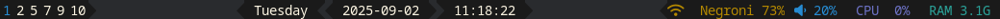

# My Dotfiles

These are my dotfiles for Fedora Linux with Sway window manager. They work for me and my workflow. They may not work for you and your workflow. Dotfiles are very personal. I recommend against copying anyone's dotfiles directly and in favour of looking at the screenshots, reading the files, and deciding what would work for you. I also recommend looking at other people's dotfiles and see how they solve the same problems.

## Details

* **OS**: [Fedora](https://www.fedoraproject.org)
* **Window manager**: [Sway](https://www.github.com/swaywm/sway)
* **Status bar**: [Waybar](https://www.github.com/Alexays/Waybar)
* **Notifications**: [Dunst](https://www.github.com/dunst-project/dunst)
* **Terminal**: [Foot](https://www.github.com/alacritty/alacritty)
* **Editor**: [Neovim](https://www.github.com/neovim/Neovim)
* **IDE**: None
* **File manager**: [Yazi](https://www.github.com/sxyyazi/yazi)
* **Spotify client**: [spotify_player](https://www.github.com/aome510/spotify-player)
* **Browser**: Firefox
* **DB Client**: [Rainfrog](https://github.com/achristmascarl/rainfrog)
* **CSV Reader**: [csvlens](https://www.github.com/YS-L/csvlens)

## Screenshots

Basic state:


Status bar:


The date is centred on screen but appears off-centre here to keep all elements readable.

## Installation

The files are set up in `~/software/dotfiles_desktop/config`

### Install GitHub

Everything is saved and linked to GitHub.

Install gh (GitHub client):

```bash
sudo dnf install gh -y
```

Run this to create auth tokens (it will automatically open a browser to authenticate):
```bash
gh auth login --hostname github.com --git-protocol ssh --web --skip-ssh-key
```

### Install dotfiles

Create the software directory and clone the repo:
```bash
mkdir -p ~/software
git clone https://github.com/David-Manning/dotfiles_desktop ~/software/dotfiles_desktop
```

Run the bootstrap script:

```
cd ~/software/dotfiles_desktop
./bootstrap.sh
```

### Minimal zshrc
**ON SERVERS ONLY**:
Link to the minimal zshrc. This is intended to be a minimal zshrc, not for desktop use.

```
ln -s ~/software/dotfiles_desktop/config/zshrc ~/.config/zshrc
rm ~/.zshrc
ln -s ~/software/dotfiles_desktop/.zshrc ~/.zshrc
```

### Stan Syntax Highlighting

If Stan syntax highlighting is not working, run these:

* Clone `https://github.com/WardBrian/tree-sitter-stan into ~/software/tree-sitter-stan/`.
* Run `tree-sitter build --output ~/.local/share/nvim/site/parser/stan.so ~/software/tree-sitter-stan/grammars/stan/`.
* Run `install_stan_queries.zsh` to pull the `.scm` files.

To install treesitter, run `npm install -g tree-sitter-cli`. On Windows, you will also need to install Visual Studio Build Tools to compile C code.

## Licence

This project is licensed under the MIT Licence - see the [LICENSE](LICENSE) file for details.


